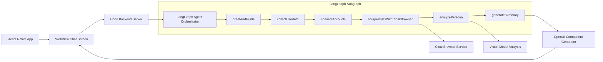
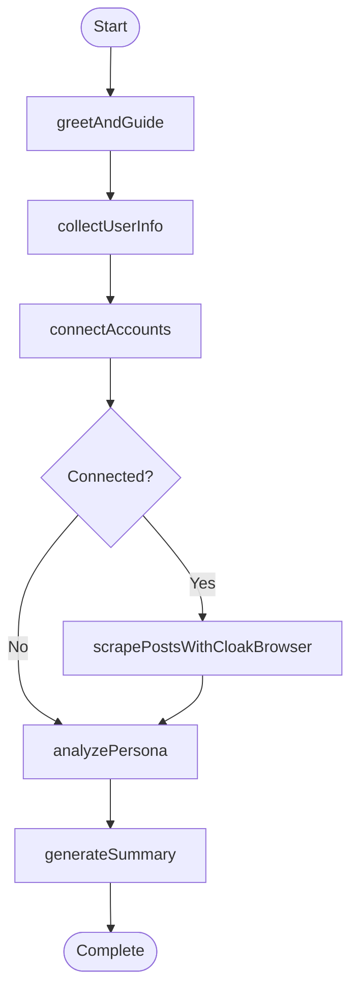
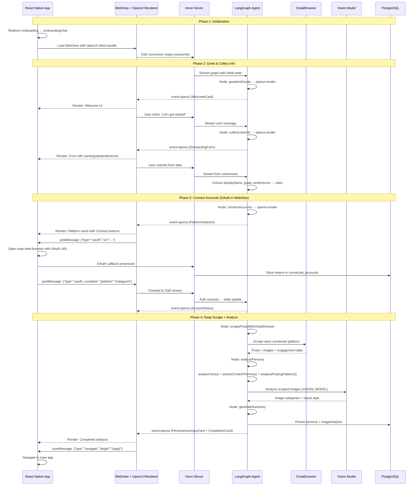

# Chat-Driven Onboarding with LangGraph Agent + OpenUI

## Research Summary

**@openuidev/react-lang v0.2.4 (April 2026)**: Core runtime for generative UI — `defineComponent()`, `createLibrary()`, `Renderer` for progressive streaming of OpenUI Lang output. System prompts generated via `library.prompt()`. LLMs stream structured UI definitions that render as React components. Requires React >=19.0.0 (project has 19.2.0 — confirmed compatible). Source: [npm registry](https://registry.npmjs.org/@openuidev/react-lang)

**@openuidev/react-ui v0.11.6 (May 2026)**: Prebuilt chat layouts and component libraries. Requires React >=19, react-dom >=19, Zustand ^4.5.5. 11.3MB unpacked. Includes `openuiLibrary` and `openuiChatLibrary` preconfigured sets. Source: [npm registry](https://registry.npmjs.org/@openuidev/react-ui)

**LangGraph JS + Hono SSE**: Confirmed compatible — `graph.stream()` returns `IterableReadableStream` that works with Hono's `streamSSE()`. LangGraphJS's own API server uses this exact pattern internally. Requires keep-alive handling (`waitKeepAlive` pattern) to prevent premature stream closure. Source: [LangGraphJS source](https://github.com/langchain-ai/langgraphjs)

**@langchain/langgraph-checkpoint-postgres v1.0.1 (Feb 2026)**: Stable, well-maintained. Uses `pg` ^8.12.0. Accepts connection string or existing `pg.Pool`. ~229K weekly downloads. Source: [npm registry](https://registry.npmjs.org/@langchain/langgraph-checkpoint-postgres)

**CloakBrowser v0.3.28 (May 2026)**: npm package (`cloakbrowser`) exporting Playwright-compatible `launch()` API. Direct import in Node.js — not an HTTP service. Spawns browser processes locally. `humanize=True` flag for human-like behavior. Passes Cloudflare, FingerprintJS, and 30+ bot detection sites. Session cookies can be persisted via Playwright's `storageState`. Source: [CloakBrowser npm](https://registry.npmjs.org/cloakbrowser)

**openai npm v6.38.0 (May 2026)**: Fully supports custom `baseURL` for OpenAI-compatible APIs. DashScope compatible-mode endpoint works out of the box. Avoid custom `undici` dispatcher — use native Node.js `fetch`. Source: [openai npm](https://registry.npmjs.org/openai)

**React Native WebView postMessage**: Android dispatches `postMessage` events on `document`, iOS on `window`. Cross-platform workaround: use `injectJavaScript` from native side, or conditional event listener setup in WebView JS. Source: [react-native-webview docs](https://github.com/react-native-webview/react-native-webview)

---

## Architecture Overview




---

## LangGraph Agent Subgraph Nodes


| Node                          | Function                                                                                                                                                                        | Tools Used                          | Output State                                                        |
| ----------------------------- | ------------------------------------------------------------------------------------------------------------------------------------------------------------------------------- | ----------------------------------- | ------------------------------------------------------------------- |
| `greetAndGuide`               | LLM generates WelcomeCard via OpenUI tool, explains onboarding flow                                                                                                             | `openui-render`                     | `{ messages, currentStep: "collect_info" }`                         |
| `collectUserInfo`             | LLM generates OnboardingForm, extracts displayName/goals/preferences from user form submissions                                                                                 | `openui-render`                     | `{ displayName, goals, preferences }`                               |
| `connectAccounts`             | LLM generates PlatformSelector, calls `oauth-connect` per platform, handles OAuth flow via WebView postMessage bridge                                                           | `openui-render`, `oauth-connect`    | `{ connectedAccounts }`                                             |
| `scrapePostsWithCloakBrowser` | Conditional: if `connectedAccounts.length > 0`, calls `cloakbrowser-scrape` per platform, merges with existing adapter data. Falls back to OAuth adapter if CloakBrowser fails. | `cloakbrowser-scrape`               | `{ scrapedPosts, scrapedImages }`                                   |
| `analyzePersona`              | Calls existing `analyzeTone()`, `extractContentThemes()`, `analyzePostingPatterns()` + new `vision-analyze` tool for image categories/style                                     | `vision-analyze`, existing analysis | `{ toneIndicators, contentThemes, postingPatterns, imageAnalysis }` |
| `generateSummary`             | Persists persona to DB via existing `persona-extraction` service, LLM generates PersonaSummaryCard + CompletionCard via OpenUI                                                  | `openui-render`, DB                 | `{ personaSummary, currentStep: "complete" }`                       |


### State Schema (Zod v4)

```typescript
const OnboardingStateSchema = z.object({
  // Accumulated user info
  displayName: z.string().nullable().default(null),
  goals: z.array(z.string()).default([]),
  preferences: z.record(z.string(), z.unknown()).nullable().default(null),
  // Connection state
  selectedPlatforms: z.array(z.string()).default([]),
  connectedAccounts: z.array(z.object({
    platform: z.string(),
    status: z.enum(["connecting", "connected", "failed"]),
    username: z.string().nullable(),
    profileData: z.unknown().nullable(),
  })).default([]),
  // Scraped data
  scrapedPosts: z.array(z.object({
    platform: z.string(),
    text: z.string(),
    mediaType: z.string().nullable(),
    imageUrl: z.string().nullable(),
    postedAt: z.string().nullable(),
    likes: z.number().nullable(),
    comments: z.number().nullable(),
    shares: z.number().nullable(),
  })).default([]),
  scrapedImages: z.array(z.string()).default([]),
  // Analysis results
  toneIndicators: z.object({
    avgSentenceLength: z.number(),
    emojiFrequency: z.number(),
    questionUsage: z.number(),
    exclamationUsage: z.number(),
    avgHashtagCount: z.number(),
    dominantTone: z.enum(["professional", "casual", "witty", "educational", "inspirational", "mixed"]),
  }).nullable().default(null),
  contentThemes: z.array(z.string()).default([]),
  postingPatterns: z.object({
    avgPostsPerWeek: z.number(),
    preferredDays: z.array(z.string()),
    preferredTimes: z.array(z.string()),
    mostActivePlatform: z.string(),
  }).nullable().default(null),
  imageAnalysis: z.object({
    categories: z.record(z.string(), z.number()),
    visualStyle: z.array(z.string()),
    imageCount: z.number(),
  }).nullable().default(null),
  // Chat state
  messages: z.array(z.object({
    role: z.enum(["user", "assistant"]),
    content: z.string(),
  })).default([]),
  currentStep: z.enum(["greet", "collect_info", "connect_accounts", "scrape_posts", "analyze", "complete"]).default("greet"),
  personaSummary: z.unknown().nullable().default(null),
  // Session metadata
  sessionId: z.string(),
  userId: z.string(),
});
```

### Node Routing Logic




Each node updates state and signals the next. The `checkPlatforms` conditional edge handles the case where a user skips account connection — the analysis node can work with manually-entered info as a fallback.

### LangGraph Streaming Strategy

The LLM inside each node generates OpenUI Lang directly. The system prompt includes the component library definitions (Zod schemas + descriptions) so the model is constrained to valid component calls. The flow:

1. Node receives current state
2. Node calls LLM via DashScope API (using `BASE_URL` + `MODEL` from `.env`)
3. LLM receives system prompt with component library + user context
4. LLM streams OpenUI Lang output
5. Node parses output, validates against component Zod schemas
6. Node emits OpenUI Lang to SSE stream as `event:openui`
7. Node extracts structured data (form values, platform selections) from LLM response or user input
8. Node updates state and returns

### PostgreSQL Checkpointer

Uses `@langchain/langgraph-checkpoint-postgres` with the existing `DATABASE_URL`. Sessions are keyed by `sessionId` (UUID generated on first chat request). Enables:

- Resume interrupted onboarding sessions
- Persist conversation history across server restarts
- Multi-session isolation (each user gets their own thread)

---

## Implementation Approach

### Phase 1: Dependencies + Config

1. **Install packages**: `@langchain/langgraph`, `@langchain/core`, `@langchain/langgraph-checkpoint-postgres`, `@openuidev/react-lang`, `@openuidev/react-ui`, `openai`, `react-native-webview` (via `npx expo install`), `eventsource-parser`
2. **Install OpenUI client build tools**: `vite`, `@vitejs/plugin-react` (dev deps for `src/onboarding-chat/` bundling)
3. **Add env vars** to `src/server/config.ts` and `.env.example`:
  - `API_KEY` (z.string()) — DashScope API key (exists in `.env` but not in config)
  - `BASE_URL` (z.string()) — DashScope API base URL
  - `MODEL` (z.string()) — LLM model name
  - `VISION_MODEL` (z.string().default("qwen3.6-plus"))
  - `CLOAKBROWSER_ENDPOINT` (z.string().optional())
  - These are referenced by `src/server/agents/onboarding-agent/` tools

### Phase 2: Backend — LangGraph Agent Infrastructure

1. **OpenUI Component Library** (`src/server/agents/onboarding-agent/components/library.ts`):
  - Define 7 components using `defineComponent()` from `@openuidev/react-lang`:
    - `WelcomeCard` — greeting text, subtitle, CTA button ("Let's get started")
    - `OnboardingForm` — fields (name text, goals multi-select, preferences), submit button
    - `PlatformSelector` — grid of platform cards (Instagram, Twitter, Pinterest) with connect buttons
    - `AccountStatus` — list of connected accounts with status indicators
    - `LoadingIndicator` — progress spinner with status text
    - `PersonaSummaryCard` — tone badges, themes, posting schedule, image analysis
    - `CompletionCard` — summary + "Get Started" CTA
  - Each component has a Zod schema for props and a description for the LLM system prompt
  - Call `createLibrary()` with these components
  - Export `library.prompt()` for generating the system prompt
2. **LangGraph Tools** (`src/server/agents/onboarding-agent/tools/`):
  - `openui-render.ts`: Takes user message + context, calls DashScope LLM with system prompt (includes component library), parses response into OpenUI Lang. Uses `API_KEY`, `BASE_URL`, `MODEL` from config.
  - `cloakbrowser-scrape.ts`: LangGraph tool that `import { launch } from 'cloakbrowser'`, spawns a stealth browser process per scrape request, navigates to target profile, extracts posts/images/engagement, closes browser. Uses Playwright's `storageState` for cookie persistence — loads saved cookies from disk before navigation, saves after scraping. Falls back to existing OAuth platform adapters if CloakBrowser fails (rate limit, login wall, etc.).
  - `vision-analyze.ts`: Uses `openai` package with `BASE_URL`/`VISION_MODEL`/`API_KEY`. Sends image URLs in `image_url` format, receives structured JSON back with categories + style.
  - `oauth-connect.ts`: Wraps existing platform adapters (`src/server/adapters/`). Takes platform, returns auth URL. On callback, exchanges code for tokens via existing `connectAndExtractPersona()`.
3. **LangGraph Nodes** (`src/server/agents/onboarding-agent/nodes/`):
  - Each node is a `StateGraph` node function that: (a) reads current state, (b) calls appropriate tools, (c) returns state updates
  - `greet-and-guide.ts`: Calls `openui-render` to generate WelcomeCard. Returns `{ messages: [{ role: "assistant", content: "Welcome..." }], currentStep: "collect_info" }`
  - `collect-user-info.ts`: Generates OnboardingForm. On user submission, extracts displayName/goals/preferences from the response data. Returns updated fields.
  - `connect-accounts.ts`: Generates PlatformSelector. For each platform the user connects, calls `oauth-connect` tool. Waits for OAuth callback via the WebView bridge. Updates `connectedAccounts` array.
  - `scrape-posts.ts`: Conditional node. If `connectedAccounts.length > 0`, iterates each platform and calls `cloakbrowser-scrape` tool. Merges scraped posts into `scrapedPosts` array, image URLs into `scrapedImages`.
  - `analyze-persona.ts`: Converts `scrapedPosts` to `RecentPost[]` format, calls existing `analyzeTone()`, `extractContentThemes()`, `analyzePostingPatterns()`. If `scrapedImages.length > 0`, calls `vision-analyze` tool. Returns all analysis results.
  - `generate-summary.ts`: Calls existing `persona-extraction` service to persist to DB. Calls `openui-render` to generate PersonaSummaryCard + CompletionCard. Returns `{ personaSummary, currentStep: "complete" }`
4. **Graph Composition** (`src/server/agents/onboarding-agent/graph.ts`):
  - Create `StateGraph` with `OnboardingStateSchema`
  - Register all 6 nodes
  - Define edges: greet → collect → connect → (conditional scrape) → analyze → generate
  - Configure PostgreSQL checkpointer with existing `DATABASE_URL`
  - Export `createOnboardingGraph()` factory function
  - Export `streamOnboarding(sessionId, userId, message)` that handles SSE-compatible streaming via `graph.stream()`

### Phase 3: Backend — CloakBrowser + Vision + DB

1. **CloakBrowser Scraping Service** (`src/server/services/cloakbrowser/`):
  - `client.ts`: Wraps `import { launch } from 'cloakbrowser'`. Manages browser lifecycle: launch with `humanize: true`, create page, set cookies from persisted `storageState.json`, return browser+page handles. `close()` saves updated cookies to disk before closing.
  - `cookie-store.ts`: Per-user cookie persistence at `src/server/services/cloakbrowser/cookies/{userId}-{platform}.json`. Uses Playwright's `browser.context().storageState()` to save, `storageState` option on context creation to load. One-time manual login flow seeds the cookie store.
  - `scrape-strategies/instagram-scraper.ts`: Navigate to Instagram profile URL, scroll to trigger lazy-load, extract captions, image URLs, likes, comments, timestamps from DOM elements.
  - `scrape-strategies/twitter-scraper.ts`: Navigate to X profile, scroll, extract tweets, media URLs, engagement metrics, timestamps.
  - `scrape-strategies/pinterest-scraper.ts`: Navigate to Pinterest profile, extract pins, image URLs, descriptions.
  - Each strategy returns `Array<{ platform, text, mediaType, imageUrl, postedAt, likes?, comments?, shares? }>`
  - **Fallback**: If CloakBrowser fails (launch error, navigation timeout, login wall), the tool catches the error and falls back to existing OAuth platform adapters (`src/server/adapters/`), which return limited but structured data.
2. **Vision Analysis** (`src/server/services/persona-analysis.ts`):
  - Add `analyzeImages(imageUrls: string[]): Promise<ImageAnalysis>` function
  - Constructs vision model prompt: "Analyze these social media images. Return JSON with: categories (count by type: selfies, food, landscapes, product-shots, text-heavy, other), visualStyle (array of style tags: bright, dark, filtered, professional, casual), imageCount"
  - Calls `openai` package with `VISION_MODEL` and `BASE_URL` from config
  - Parses response, returns structured `ImageAnalysis`
3. **Type + Schema Updates**:
  - `src/types/persona.ts`: Add `ImageAnalysis` interface, add `imageAnalysis?: ImageAnalysis` to `PersonaSummary`
  - `src/db/schema/personas.ts`: Add `imageAnalysis: jsonb('image_analysis')` to `user_personas` table
  - Run `drizzle-kit generate && drizzle-kit migrate`

### Phase 4: Backend — Hono SSE Endpoint

1. **SSE Route** (`src/server/routes/onboarding-chat.ts`):
  - `POST /api/onboarding/chat`
  - Request body: `{ sessionId: string, userId: string, message: string }`
  - Creates or resumes LangGraph thread via checkpointer
  - Uses Hono's `streamSSE()` to stream events:
    - `event: text` — LLM text messages
    - `event: openui` — `{ lang: string, component: string, props: object }` for UI rendering
    - `event: step` — `{ currentStep: string, progress: number }` for progress tracking
    - `event: done` — `{ sessionId, finalState }` on completion
  - **Keep-alive handling**: Use LangGraphJS's `waitKeepAlive` pattern to prevent premature stream closure (Hono issue #2050). Implement with periodic heartbeat writes during long-running nodes (scraping, analysis).
  - Mount in `src/server/index.ts` under `/api/onboarding`
2. **Static File Serving** for OpenUI client bundle:
  - Configure Hono to serve `src/onboarding-chat/dist/` at `/onboarding-chat/` path
  - Add `serveStatic` middleware from `@hono/node-server`

### Phase 5: Frontend — OpenUI Client Bundle

1. **Vite App** (`src/onboarding-chat/`):
  - `package.json`: `react`, `react-dom`, `@openuidev/react-lang`, `@openuidev/react-ui`
  - `vite.config.ts`: Build config, output to `dist/`, React plugin
  - `index.html`: Entry HTML with Tailwind CDN link for styling
  - `src/main.tsx`: Renders `<ChatApp />` component
  - `src/chat-app.tsx`: Main chat layout with message list, input bar, and OpenUI Renderer
  - `src/sse-client.ts`: EventSource connection to `/api/onboarding/chat`, message sending, OpenUI Lang parsing, reconnection logic
  - `src/components/`: React renderers for each server-side component definition:
    - `WelcomeCard.tsx` — renders welcome message with CTA button
    - `OnboardingForm.tsx` — renders form with controlled inputs, submit handler
    - `PlatformSelector.tsx` — renders platform cards with connect buttons
    - `AccountStatus.tsx` — renders connection status badges
    - `PersonaSummaryCard.tsx` — renders analysis results
    - `CompletionCard.tsx` — renders final summary + "Get Started" button
    - `LoadingIndicator.tsx` — renders spinner with status text
2. **Component Rendering Strategy**:
  - Each component receives props from OpenUI Lang parsed by `@openuidev/react-lang` Renderer
  - Props are validated against the same Zod schemas used on the server
  - Form components emit user responses via `window.ReactNativeWebView.postMessage()`
  - CTA buttons emit navigation commands via postMessage

### Phase 6: Frontend — WebView + Routing

1. **WebView Chat Screen** (`src/app/onboarding/chat.tsx`):
  - Full-screen WebView from `react-native-webview`
  - Source: `{ uri:` ${SERVER_URL}/onboarding-chat/ `}` (dev) or bundled local file (prod)
  - `onMessage` handler:
    - `{"type": "submit", "payload": {...}}` → POST to `/api/onboarding/chat`, forward response to WebView
    - `{"type": "navigate", "target": "/(app)"}` → use `router.replace("/(app)")`
    - `{"type": "oauth", "url": "https://..."}` → open `expo-web-browser`, capture callback, send result back to WebView
  - **Cross-platform postMessage**: Use `injectJavaScript` instead of `postMessage` for sending data to WebView (Android dispatches on `document`, iOS on `window` — `injectJavaScript` works consistently on both). In WebView JS, receive via both `window.addEventListener('message')` and `document.addEventListener('message')`.
  - Loading: show spinner while WebView loads
  - Error fallback: show "Connection lost" with retry button
2. **OAuth in WebView Flow**:
  - User clicks "Connect Instagram" in WebView PlatformSelector
  - WebView sends `{"type": "oauth", "url": authUrl}` via postMessage
  - Native side opens `expo-web-browser` with auth URL
  - On OAuth callback, backend processes token, stores in DB
  - Native side sends `{"type": "oauth_complete", "platform": "instagram", "success": true}` back to WebView
  - WebView updates PlatformSelector to show "Connected" state
  - Agent continues to next step
3. **Routing Updates**:
  - `src/app/onboarding/index.tsx`: Loading screen with `useEffect` → `router.replace("/onboarding/chat")`
  - `src/app/onboarding/_layout.tsx`: Simplified to single `<Stack.Screen name="chat" />` (no header)
  - `src/app/onboarding/connect.tsx` → archive to `src/app/onboarding/archive/connect.tsx`
  - `src/app/onboarding/review.tsx` → archive to `src/app/onboarding/archive/review.tsx`
  - `src/app/index.tsx`: Existing redirect logic unchanged (still uses `useOnboarding()`)

---

## File Changes


| File                                                                      | Change                                                                                                                                                                                                                                                                                                                                 | API/Pattern                         |
| ------------------------------------------------------------------------- | -------------------------------------------------------------------------------------------------------------------------------------------------------------------------------------------------------------------------------------------------------------------------------------------------------------------------------------- | ----------------------------------- |
| `package.json`                                                            | Add: `@langchain/langgraph`, `@langchain/core`, `@langchain/langgraph-checkpoint-postgres`, `@openuidev/react-lang`, `@openuidev/react-ui`, `openai`, `eventsource-parser`, `cloakbrowser`, `pg`. Add devDeps: `vite`, `@vitejs/plugin-react`, `@types/pg`. Install `react-native-webview` via `npx expo install react-native-webview` | npm + expo install                  |
| `src/server/config.ts`                                                    | Add: `API_KEY`, `BASE_URL`, `MODEL`, `VISION_MODEL`, `CLOAKBROWSER_ENDPOINT` to env schema                                                                                                                                                                                                                                             | `zod` v4.4.3                        |
| `.env.example`                                                            | Add: `API_KEY=sk-...`, `BASE_URL=https://...`, `MODEL=qwen3.6-plus`, `VISION_MODEL=qwen3.6-plus`. Remove: `CLOAKBROWSER_ENDPOINT` (CloakBrowser is npm package, not HTTP service). Add note about CloakBrowser needing `npx cloakbrowser install` for browser binary                                                                   | —                                   |
| `src/server/agents/onboarding-agent/state.ts`                             | Create: Full Zod v4 schema with defaults, types, and `OnboardingState` export                                                                                                                                                                                                                                                          | `zod` v4.4.3                        |
| `src/server/agents/onboarding-agent/components/library.ts`                | Create: 7 components via `defineComponent()` (WelcomeCard, OnboardingForm, PlatformSelector, AccountStatus, LoadingIndicator, PersonaSummaryCard, CompletionCard), `createLibrary()`, export `library.prompt()`                                                                                                                        | `@openuidev/react-lang`             |
| `src/server/agents/onboarding-agent/tools/openui-render.ts`               | Create: LLM tool that calls DashScope API with component library system prompt, parses OpenUI Lang response                                                                                                                                                                                                                            | `openai` package + DashScope        |
| `src/server/agents/onboarding-agent/tools/cloakbrowser-scrape.ts`         | Create: LangGraph tool using `import { launch } from 'cloakbrowser'`, spawns browser per scrape, uses storageState for cookie persistence, falls back to OAuth adapters on failure                                                                                                                                                     | `cloakbrowser` npm package          |
| `src/server/agents/onboarding-agent/tools/vision-analyze.ts`              | Create: LangGraph tool calling VISION_MODEL with `image_url` format for image analysis                                                                                                                                                                                                                                                 | `openai` package                    |
| `src/server/agents/onboarding-agent/tools/oauth-connect.ts`               | Create: LangGraph tool wrapping existing platform adapters for OAuth flow initiation                                                                                                                                                                                                                                                   | Existing `src/server/adapters/`     |
| `src/server/agents/onboarding-agent/nodes/greet-and-guide.ts`             | Create: Generates WelcomeCard via openui-render, sets currentStep to collect_info                                                                                                                                                                                                                                                      | `StateGraph` node                   |
| `src/server/agents/onboarding-agent/nodes/collect-user-info.ts`           | Create: Generates OnboardingForm, extracts user data from form submissions                                                                                                                                                                                                                                                             | OpenUI OnboardingForm               |
| `src/server/agents/onboarding-agent/nodes/connect-accounts.ts`            | Create: Generates PlatformSelector, calls oauth-connect per platform, handles async OAuth callbacks                                                                                                                                                                                                                                    | OAuth tools + OpenUI                |
| `src/server/agents/onboarding-agent/nodes/scrape-posts.ts`                | Create: Conditional node, calls cloakbrowser-scrape per connected platform, merges results                                                                                                                                                                                                                                             | CloakBrowser service                |
| `src/server/agents/onboarding-agent/nodes/analyze-persona.ts`             | Create: Calls existing analysis functions + vision-analyze for images                                                                                                                                                                                                                                                                  | Vision model + existing pipeline    |
| `src/server/agents/onboarding-agent/nodes/generate-summary.ts`            | Create: Persists persona to DB, generates PersonaSummaryCard + CompletionCard                                                                                                                                                                                                                                                          | DB + OpenUI                         |
| `src/server/agents/onboarding-agent/graph.ts`                             | Create: StateGraph with 6 nodes, conditional edges, PostgreSQL checkpointer, `streamOnboarding()` export                                                                                                                                                                                                                               | `@langchain/langgraph`              |
| `src/server/agents/onboarding-agent/index.ts`                             | Create: Barrel exports + graph factory                                                                                                                                                                                                                                                                                                 | —                                   |
| `src/server/routes/onboarding-chat.ts`                                    | Create: `POST /api/onboarding/chat` SSE endpoint with LangGraph streaming, 4 event types (text, openui, step, done)                                                                                                                                                                                                                    | Hono `streamSSE()`                  |
| `src/server/index.ts`                                                     | Modify: Mount `/api/onboarding` route + static file serving for `/onboarding-chat/`                                                                                                                                                                                                                                                    | `serveStatic` middleware            |
| `src/server/services/cloakbrowser/client.ts`                              | Create: Wraps `launch()` from cloakbrowser npm, manages browser lifecycle with humanize flag, cookie load/save                                                                                                                                                                                                                         | `cloakbrowser` npm + Playwright API |
| `src/server/services/cloakbrowser/cookie-store.ts`                        | Create: Per-user cookie persistence using Playwright storageState, saves/loads cookies at `cookies/{userId}-{platform}.json`                                                                                                                                                                                                           | Playwright `storageState` API       |
| `src/server/services/cloakbrowser/scrape-strategies/instagram-scraper.ts` | Create: Instagram profile scraper — posts, images, engagement                                                                                                                                                                                                                                                                          | CloakBrowser navigation             |
| `src/server/services/cloakbrowser/scrape-strategies/twitter-scraper.ts`   | Create: X/Twitter profile scraper — tweets, media, engagement                                                                                                                                                                                                                                                                          | CloakBrowser navigation             |
| `src/server/services/cloakbrowser/scrape-strategies/pinterest-scraper.ts` | Create: Pinterest profile scraper — pins, images, descriptions                                                                                                                                                                                                                                                                         | CloakBrowser navigation             |
| `src/server/services/persona-analysis.ts`                                 | Modify: Add `analyzeImages(imageUrls: string[]): Promise<ImageAnalysis>` function                                                                                                                                                                                                                                                      | `openai` + VISION_MODEL             |
| `src/types/persona.ts`                                                    | Modify: Add `ImageAnalysis` interface, add `imageAnalysis` to `PersonaSummary`                                                                                                                                                                                                                                                         | New type                            |
| `src/db/schema/personas.ts`                                               | Modify: Add `imageAnalysis: jsonb('image_analysis')` to `user_personas` table                                                                                                                                                                                                                                                          | Drizzle ORM                         |
| `src/app/onboarding/index.tsx`                                            | Modify: Replace with loading screen → redirect to `/onboarding/chat`                                                                                                                                                                                                                                                                   | `expo-router`                       |
| `src/app/onboarding/chat.tsx`                                             | Create: Full-screen WebView with postMessage bridge for chat input, OAuth, navigation                                                                                                                                                                                                                                                  | `react-native-webview`              |
| `src/app/onboarding/_layout.tsx`                                          | Modify: Simplify to single `<Stack.Screen name="chat" />`                                                                                                                                                                                                                                                                              | Remove old 3-screen stack           |
| `src/app/onboarding/connect.tsx`                                          | Archive: Move to `src/app/onboarding/archive/connect.tsx`                                                                                                                                                                                                                                                                              | —                                   |
| `src/app/onboarding/review.tsx`                                           | Archive: Move to `src/app/onboarding/archive/review.tsx`                                                                                                                                                                                                                                                                               | —                                   |
| `src/onboarding-chat/package.json`                                        | Create: Vite React 19 app with `@openuidev/react-lang`, `@openuidev/react-ui`                                                                                                                                                                                                                                                          | React 19 + Vite                     |
| `src/onboarding-chat/vite.config.ts`                                      | Create: Vite config, output to `dist/`, React plugin                                                                                                                                                                                                                                                                                   | `vite`                              |
| `src/onboarding-chat/index.html`                                          | Create: HTML entry with Tailwind CDN, loads built bundle                                                                                                                                                                                                                                                                               | Tailwind CDN                        |
| `src/onboarding-chat/src/main.tsx`                                        | Create: React entry point rendering `<ChatApp />` with OpenUI Renderer                                                                                                                                                                                                                                                                 | `@openuidev/react-lang`             |
| `src/onboarding-chat/src/chat-app.tsx`                                    | Create: Chat layout with message list, input bar, SSE connection management                                                                                                                                                                                                                                                            | SSE client                          |
| `src/onboarding-chat/src/sse-client.ts`                                   | Create: EventSource wrapper, message sending, OpenUI Lang parsing, auto-reconnect                                                                                                                                                                                                                                                      | `eventsource-parser`                |
| `src/onboarding-chat/src/components/WelcomeCard.tsx`                      | Create: Welcome UI with CTA button                                                                                                                                                                                                                                                                                                     | OpenUI component renderer           |
| `src/onboarding-chat/src/components/OnboardingForm.tsx`                   | Create: Form with controlled inputs, submit via postMessage                                                                                                                                                                                                                                                                            | OpenUI component renderer           |
| `src/onboarding-chat/src/components/PlatformSelector.tsx`                 | Create: Platform cards with connect buttons, OAuth trigger via postMessage                                                                                                                                                                                                                                                             | OpenUI component renderer           |
| `src/onboarding-chat/src/components/AccountStatus.tsx`                    | Create: Connection status badges                                                                                                                                                                                                                                                                                                       | OpenUI component renderer           |
| `src/onboarding-chat/src/components/PersonaSummaryCard.tsx`               | Create: Analysis results display with tone, themes, patterns, images                                                                                                                                                                                                                                                                   | OpenUI component renderer           |
| `src/onboarding-chat/src/components/CompletionCard.tsx`                   | Create: Final summary + "Get Started" navigation via postMessage                                                                                                                                                                                                                                                                       | OpenUI component renderer           |
| `src/onboarding-chat/src/components/LoadingIndicator.tsx`                 | Create: Spinner with status text                                                                                                                                                                                                                                                                                                       | OpenUI component renderer           |


---

## Data Flow




---

## Verification Steps

- `npm run typecheck` (0 errors across all modified/new files)
- `npm run lint` (0 warnings)
- `npm run build` (success for Expo app)
- `cd src/onboarding-chat && npm run build` (Vite build succeeds, outputs to `dist/`)
- LangGraph agent streams events correctly — test `streamOnboarding()` with mock input, verify SSE event types (text, openui, step, done)
- OpenUI component library validates against Zod schemas — test all 7 component definitions
- OpenUI client bundle loads in WebView and renders WelcomeCard on first connection
- PostgreSQL checkpointer persists session state — interrupt and resume test
- CloakBrowser scraper returns structured post data for at least one platform
- Vision model analyzes sample images and returns categorized JSON
- Persona summary includes imageAnalysis section in the DB
- `drizzle-kit generate` produces valid migration, `drizzle-kit migrate` applies it
- OAuth flow: WebView → expo-web-browser → callback → AccountStatus update (end-to-end test)
- WebView postMessage bridge handles: submit, navigate, oauth, error types
- SSE client auto-reconnects on dropped connection
- Onboarding completion sets AsyncStorage flag and navigates to `/(app)`
- Existing `(app)` routes unaffected — dashboard, compose, analytics still work
- `src/app/onboarding/connect.tsx` and `review.tsx` archived, not deleted
- Env vars in `.env.example` match `config.ts` schema
- No API keys or secrets in client-side code

---

## Breaking Changes & Migrations

**Onboarding flow deprecation**:

- `src/app/onboarding/connect.tsx` and `src/app/onboarding/review.tsx` will be deleted
- `src/app/onboarding/index.tsx` repurposed as WebView loader
- `_layout.tsx` simplified from 3-screen stack to single screen
- **Migration**: Archive old files in `src/app/onboarding/archive/` before deletion for reference

**Database migration**:

- Add `imageAnalysis JSONB` column to `user_personas` table
- Run: `drizzle-kit generate && drizzle-kit migrate`

**Package additions**:

- `@langchain/langgraph` — requires Node.js streams support (standard in Node 18+)
- `@openuidev/react-lang` — requires React 19+ (already in package.json)
- `react-native-webview` — standard Expo package
- `openai` — for OpenAI-compatible API calls to DashScope

---

## Security Considerations

**LLM API Key Exposure**: The `API_KEY` in `.env` is used server-side only. The WebView communicates with the Hono backend — no direct LLM API calls from the client. The WebView should only receive rendered UI and chat messages, never API keys. The OpenUI client bundle has zero knowledge of LLM credentials.

**CloakBrowser Authentication**: CloakBrowser credentials stored in server-side `.env`, never exposed to client. Scraping should respect rate limits and platform ToS. CloakBrowser session state should be scoped per-user and cleaned up after scraping completes to avoid stale sessions.

**OAuth Token Storage**: OAuth tokens continue to be stored in `connected_accounts` table with encryption (existing `TOKEN_ENCRYPTION_KEY`). The LangGraph agent should only handle tokens in memory, never log them. The OAuth callback flow (`expo-web-browser`) must not expose tokens to the WebView — the native side handles the redirect and only sends a success/failure signal back.

**SSE Stream Security**: The `/api/onboarding/chat` SSE endpoint should validate `sessionId` and `userId` on every request. The PostgreSQL checkpointer ensures session isolation — user A cannot resume user B's session. For MVP, userId is hardcoded — production needs JWT auth.

**OpenUI Lang Validation**: The OpenUI parser should only render components from the registered library. Malicious or malformed OpenUI Lang from the LLM should be rejected by the Zod schema validation. The client-side Renderer must validate props against the same Zod schemas defined on the server.

**Vision Model Data**: Images sent to the vision model should be handled per privacy best practices — no PII retention, temporary processing only. Image URLs are passed directly to the vision model API (DashScope), not downloaded/stored by the backend.

**WebView postMessage Security**: The `onMessage` handler in the WebView should validate message format before forwarding to the backend. Malformed or unexpected message types should be rejected. Navigation commands should only allow whitelisted targets (e.g., `"/(app)"`).

**PostgreSQL Checkpointer Security**: Session data stored in PostgreSQL includes chat messages and persona data. The checkpointer tables should only be accessible by the Hono server. No direct client access to checkpointer tables.

**CloakBrowser Session Isolation**: Each scraping session should be isolated per-user. Use unique session identifiers to prevent cross-user data leakage. Clean up sessions after scraping completes or on timeout.

---

## Additional Implementation Notes

### What Was Missing from Initial Plan (Now Addressed)

1. **PostgreSQL checkpointer**: LangGraph needs persistent state across turns. Using `@langchain/langgraph-checkpoint-postgres` with existing `DATABASE_URL` — not just in-memory.
2. **OAuth in WebView bridge**: The `connectAccounts` node needs a postMessage bridge pattern — WebView sends OAuth request, native opens `expo-web-browser`, captures callback, sends result back. The original plan was vague on this.
3. **OpenUI client bundle build pipeline**: The WebView needs a built React app (Vite). The original plan said "local HTML/JS bundle" but didn't specify the build tool. Now using Vite with output to `dist/` served by Hono static files.
4. **API_KEY/BASE_URL/MODEL in config.ts**: These exist in `.env` but were missing from the Zod schema in `config.ts`. Added.
5. **SSE event type taxonomy**: Defined 4 event types (`text`, `openui`, `step`, `done`) with specific payload shapes for the client to parse and render correctly.
6. **7 OpenUI components (not 5)**: Added `LoadingIndicator` (for progress during long operations like scraping/analysis) and `CompletionCard` (separate from PersonaSummaryCard — provides the final "Get Started" CTA).
7. **Conditional edge for scrapePosts**: If user connects no platforms, the graph skips scraping and proceeds to analysis with manually-entered info. This was underspecified in the original plan.
8. `**src/onboarding-chat/` as standalone Vite app**: Not just a "bundle" — it's a full React app with its own `package.json`, `vite.config.ts`, `index.html`, and component tree. This is a significant structural addition.
9. **Error handling for SSE**: The SSE client needs auto-reconnect logic for dropped connections. The `sse-client.ts` handles this with exponential backoff.

### What Was Wrong in Initial Plan (Corrected After Feasibility Analysis)

1. **CloakBrowser is NOT an HTTP service**: Initial plan assumed CloakBrowser exposed an HTTP API at `CLOAKBROWSER_ENDPOINT`. It's actually an npm package (`cloakbrowser`) with a Playwright-compatible `launch()` API. The entire `cloakbrowser-scrape.ts` tool and `client.ts` service have been rewritten to use direct process spawning instead of HTTP calls. `CLOAKBROWSER_ENDPOINT` removed from env vars.
2. **Added cookie persistence layer**: Since CloakBrowser needs login state for social platforms, a `cookie-store.ts` module using Playwright's `storageState` API was added for per-user, per-platform cookie persistence.
3. **Added scraping fallback**: If CloakBrowser fails, the tool falls back to existing OAuth platform adapters. This was not in the original plan.
4. **SSE keep-alive requirement**: Hono's `streamSSE()` can close prematurely during long operations. Added `waitKeepAlive` pattern (used internally by LangGraphJS's own server) to the SSE endpoint.
5. **WebView postMessage Android bug**: Android dispatches postMessage events on `document`, not `window`. Changed to use `injectJavaScript` from native side for consistent cross-platform delivery.
6. **Additional dependencies**: Added `cloakbrowser`, `pg`, `@types/pg` to package list. `zustand` needed as peer dep for `@openuidev/react-ui`.

---

## Execution Order

Tasks execute sequentially via subagent dispatch following `agent-handoff-verification.mdc`. See the `todos` array in the plan frontmatter for the ordered task list with IDs.


| Order | Todo ID                       | Description                                                                  | Depends On                                  |
| ----- | ----------------------------- | ---------------------------------------------------------------------------- | ------------------------------------------- |
| 1     | `install-deps`                | Install all packages, verify versions                                        | None                                        |
| 2     | `config-env-updates`          | Add env vars to config.ts + .env.example                                     | None                                        |
| 3     | `agent-state-schema`          | Create Zod state schema with defaults                                        | `install-deps`                              |
| 4     | `openui-component-library`    | Define 7 components + library + prompt                                       | `agent-state-schema`                        |
| 5     | `langgraph-tools`             | Create 4 tools (openui, cloakbrowser, vision, oauth)                         | `openui-component-library`                  |
| 6     | `langgraph-nodes`             | Implement 6 graph nodes                                                      | `langgraph-tools`, `agent-state-schema`     |
| 7     | `langgraph-graph-composition` | Compose StateGraph + checkpointer + stream function + keep-alive             | `langgraph-nodes`                           |
| 8     | `cloakbrowser-service`        | CloakBrowser client + cookie-store + 3 scrape strategies with OAuth fallback | `install-deps`                              |
| 9     | `vision-analysis-integration` | Add analyzeImages() + ImageAnalysis type                                     | `install-deps`                              |
| 10    | `db-migration`                | Generate + apply Drizzle migration                                           | `vision-analysis-integration`               |
| 11    | `hono-sse-endpoint`           | Create SSE route + keep-alive + mount in server + static file serving        | `langgraph-graph-composition`               |
| 12    | `openui-client-bundle`        | Vite app + Renderer + SSE client + 7 components                              | `openui-component-library`                  |
| 13    | `webview-chat-screen`         | WebView screen + injectJavaScript bridge + postMessage handlers              | `openui-client-bundle`, `hono-sse-endpoint` |
| 14    | `onboarding-routing-update`   | Update routing, archive old screens                                          | `webview-chat-screen`                       |
| 15    | `verification`                | Full typecheck, lint, build, integration tests                               | All prior tasks                             |


**Parallel-safe tasks**: `config-env-updates` (2), `cloakbrowser-service` (8), and `vision-analysis-integration` (9) can run in parallel after `install-deps` since they touch independent file sets. All other tasks have sequential dependencies.

---

## Key Design Decisions

1. **WebView for OpenUI**: Avoids React Native Web Streams API incompatibility with langgraphjs. WebView has full browser environment.
2. **Linear graph with conditional edges**: Each node must complete before the next. Conditional edges handle skip logic (no connected platforms -> skip scraping -> show manual entry prompt).
3. **CloakBrowser as npm package (direct import)**: CloakBrowser is installed via npm (`cloakbrowser`) and used as a Playwright-compatible `launch()` API — not an HTTP service. The Hono server spawns browser processes directly per scrape request. This simplifies deployment (no separate service) but each scrape spawns a full browser process.
4. **Cookie persistence for CloakBrowser**: Uses Playwright's `storageState` API to persist cookies per user per platform. One-time manual login seeds the cookie store, subsequent scrapes reuse cookies. Avoids repeated login flows.
5. **OAuth adapter fallback for scraping**: If CloakBrowser fails (rate limit, login wall, layout change), the tool falls back to existing OAuth-based platform adapters which return limited but structured data.
6. **Vision model for image analysis**: Uses existing `qwen3.6-plus` VISION_MODEL from `.env`. Analyzes scraped images for content categories and visual style, adding a new dimension to persona analysis.
7. **SSE streaming with keep-alive**: Server-Sent Events provide streaming from Hono to WebView. Requires `waitKeepAlive` pattern to prevent premature stream closure during long-running nodes (scraping, analysis).
8. **injectJavaScript for cross-platform WebView communication**: Android dispatches postMessage on `document`, iOS on `window`. Using `injectJavaScript` from native side ensures consistent delivery to the WebView JS context.
9. **Full OpenUI pattern**: LLM generates OpenUI Lang directly (constrained by component library Zod schemas), streamed to client, parsed and rendered dynamically by OpenUI Renderer. Maximum flexibility over hybrid JSON-mapping approach.

