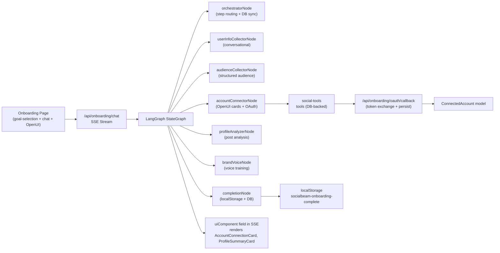

# Fix Onboarding Agent Flows — Comprehensive Implementation Plan

## Overview

Fixes all identified gaps across Flows 1.4, 1.6, and 1.7 in the onboarding agent, including OAuth persistence, brand voice system, audience definition, worked examples, OpenUI rendering, localStorage tracking, TikTok audit banner, credit awareness, persistent checkpointer, and error handling.

## Research Summary

**Prisma ConnectedAccount model** already exists in `prisma/schema.prisma` with fields: `workspaceId`, `platform`, `platformUserId`, `accessToken`, `refreshToken`, `tokenExpiry`, `status`. No migration needed for OAuth persistence.

**UserProfile model** has `audience` JSON field (`{ demographics, interests, painPoints }`) but no UI or agent step uses it.

**No BrandVoice model** exists — needs to be added to Prisma schema.

**OpenUI library** exists at `lib/openui/library.tsx` with components: `OnboardingForm`, `AccountConnectionCard`, `ProfileSummaryCard`, `StepIndicator`. Not wired into the live UI.

**LangGraph MemorySaver** used — needs persistent checkpointer for production.

Sources: Prisma schema, OpenUI library, graph.ts (all read during research).

## Implementation Approach

### Data Flow After Fix



### Architecture Changes to the Graph

New step order: `greeting` → `collect_info` → `define_audience` → `connect_accounts` → `analyze_profile` → `train_brand_voice` → `completion`

This adds two new nodes (`audienceCollectorNode`, `brandVoiceNode`) between existing nodes.

---

## File Changes

| File | Change | Rationale |
|------|--------|-----------|
| `prisma/schema.prisma` | Add `BrandVoice` model | Store voice profiles per workspace |
| `lib/db/onboarding.ts` | Add `saveOnboardingData(userId, data)` | Bulk save user info + audience + analysis in one call |
| `lib/agent/tools/social-tools.ts` | Replace stubs with DB-backed tools | OAuth persistence is the #1 blocker |
| `lib/agent/tools/audience-tools.ts` | New: saveAudience, getAudience tools | Support Flow 1.7 |
| `lib/agent/tools/brand-voice-tools.ts` | New: trainBrandVoice, getBrandVoice, previewBrandVoice | Support Flow 1.6 |
| `app/api/onboarding/oauth/callback/route.ts` | Token exchange + DB persist + fix userId in state | Fix OAuth flow |
| `lib/agent/state.ts` | Add `audienceProfile`, `brandVoiceProfile` fields | Graph state for new steps |
| `lib/agent/graph.ts` | Add new nodes + routing for audience + brand voice | Wire new steps |
| `lib/agent/nodes/audience-collector.ts` | New: structured audience collection node | Flow 1.7 implementation |
| `lib/agent/nodes/brand-voice.ts` | New: brand voice training node | Flow 1.6 implementation |
| `lib/agent/nodes/completion.ts` | Fix error handling (throw, don't swallow) | Reliability fix |
| `lib/agent/nodes/account-connector.ts` | Update prompt + add OpenUI component emission | OpenUI integration |
| `app/(auth)/onboarding/page.tsx` | Add OpenUI renderer, localStorage, worked example, TikTok audit banner, credit awareness | Full UI overhaul |
| `lib/agent/graph.ts` | Replace `MemorySaver` with `PostgresSaver` or filesystem-based checkpointer | Persistent state |
| `app/api/onboarding/chat/route.ts` | Add `uiComponent` to SSE stream | Support OpenUI rendering |
| `.env.example` | Add DB_URL for checkpointer | Configuration |

---

## Task Execution Order

### Task 1: OAuth Persistence (Blocking Foundation)

**Files**: `lib/agent/tools/social-tools.ts`, `app/api/onboarding/oauth/callback/route.ts`, `lib/agent/tools/social-tools.ts` (`initiateOauthTool` state parameter)

1. **Fix userId in OAuth state** (`lib/agent/tools/social-tools.ts` line 64):
   - `initiateOauthTool` currently hardcodes `userId: 'pending'` in the OAuth state
   - Change to accept `userId` from context (it's available from the LangGraph state)
   - Since tools are invoked by the LLM, the tool needs to read `userId` from the state — but tools don't have direct state access. Solution: The `initiateOauthTool` should be called from the node which passes the userId, OR we store userId in a server-side session map keyed by a temporary state token. **Chosen approach**: The tool accepts an optional `userId` parameter; the accountConnectorNode binds it before passing to the tool via `model.bindTools([...], { userId: state.userId })`.

   Actually, LangChain tool binding doesn't support passing extra params that way. **Better approach**: Make `initiateOauthTool` a wrapper that accepts a `userId` argument in its Zod schema (optional, defaults to empty), and the LLM will pass it when prompted.

   **Simplest correct approach**: Add `userId` as a required field in the `InitiateOauthSchema`. The system prompt will instruct the LLM to always include the userId.

2. **Fix OAuth callback route** (`app/api/onboarding/oauth/callback/route.ts`):
   - Parse `state` JSON to get platform + userId
   - Extract the authorization code
   - Call `completeOauthTool` logic inline (or a shared function) to exchange code for tokens
   - Store tokens in `ConnectedAccount` model via Prisma
   - Need to find or create a `workspaceId` — since `ConnectedAccount` requires `workspaceId`, the OAuth callback needs it. Add `workspaceId` to the OAuth state JSON.
   - Redirect to `/onboarding?oauth=success&platform=X` on success

3. **Fix `completeOauthTool`** (`lib/agent/tools/social-tools.ts`):
   - After exchanging code for tokens, also persist to `ConnectedAccount` via Prisma
   - Use `upsert` on `(workspaceId, platform)` unique constraint
   - Handle `P2002` unique constraint errors

4. **Fix `listConnectedPlatformsTool`** (`lib/agent/tools/social-tools.ts`):
   - Replace hardcoded `connected: false` with a Prisma query
   - Query `ConnectedAccount` for the user's workspace
   - Return actual connection status
   - Add `userId` to the schema so the LLM can pass it

**Verification**:
- OAuth callback stores tokens in `ConnectedAccount` table
- `listConnectedPlatformsTool` returns real connection status
- `userId` and `workspaceId` flow through OAuth state correctly

### Task 2: Add BrandVoice Model + DB Helpers

**Files**: `prisma/schema.prisma`, `lib/db/onboarding.ts`

1. **Add `BrandVoice` model** to Prisma schema:
   ```
   model BrandVoice {
     id            String   @id @default(cuid())
     workspaceId   String
     workspace     Workspace @relation(fields: [workspaceId], references: [id], onDelete: Cascade)
     tonePreset    String?  // professional | casual | witty | educational | inspirational | bold
     description   String?
     examples      Json     // array of past posts / examples
     perPlatform   Json?    // { instagram: { tone: ... }, linkedin: { tone: ... } }
     createdAt     DateTime @default(now())
     updatedAt     DateTime @updatedAt

     @@unique([workspaceId])
   }
   ```

2. **Add `saveOnboardingData`** to `lib/db/onboarding.ts`:
   - Bulk save: userInfo → `UserProfile.bio`, audience → `UserProfile.audience`, profileAnalysis → `UserProfile.tone`, `UserProfile.postTypes`, `UserProfile.imageAnalysis`, `UserProfile.audienceInsights`
   - Use `$transaction` for atomicity

3. **Run migration**: `npx prisma migrate dev --name add-brand-voice`

### Task 3: Flow 1.7 — Target Audience Definition (New Graph Node)

**Files**: `lib/agent/nodes/audience-collector.ts`, `lib/agent/tools/audience-tools.ts`, `lib/agent/state.ts`, `lib/agent/graph.ts`, `lib/agent/nodes/orchestrator.ts`

1. **Add to state** (`lib/agent/state.ts`):
   ```ts
   audienceProfile: Annotation<Record<string, unknown> | null>({
     default: () => null,
     reducer: (_current, next) => next,
   }),
   ```

2. **Create `audience-tools.ts`**:
   - `saveAudience` tool: accepts demographics, interests, painPoints, platformBehavior, competitorAccounts; saves to `UserProfile.audience`
   - `getAudience` tool: returns current audience profile if set

3. **Create `audience-collector.ts`**:
   - LLM node with structured output for audience data
   - System prompt guides collection of: demographics (age range, location), interests (multi-topic), platform behavior (peak times, preferred platforms), competitor awareness, pain points
   - Uses `saveAudience` tool to persist
   - Returns conversational response + structured audience profile

4. **Wire into graph** (`lib/agent/graph.ts`):
   - Add node: `addNode('audienceCollector', audienceCollectorNode)`
   - Add routing in `routeFromOrchestrator`: case `'define_audience'` → `'audienceCollector'`
   - Add edges: `audienceCollector` → `orchestrator`

5. **Update orchestrator** (`lib/agent/nodes/orchestrator.ts`):
   - Update `stepOrder` to: `['greeting', 'collect_info', 'define_audience', 'connect_accounts', 'analyze_profile', 'train_brand_voice', 'completion']`

### Task 4: Flow 1.6 — Brand Voice Training (New Graph Node)

**Files**: `lib/agent/nodes/brand-voice.ts`, `lib/agent/tools/brand-voice-tools.ts`, `lib/agent/state.ts`, `lib/agent/graph.ts`

1. **Add to state** (`lib/agent/state.ts`):
   ```ts
   brandVoiceProfile: Annotation<Record<string, unknown> | null>({
     default: () => null,
     reducer: (_current, next) => next,
   }),
   ```

2. **Create `brand-voice-tools.ts`**:
   - `saveBrandVoice` tool: saves voice profile to `BrandVoice` model
   - `getBrandVoice` tool: returns current voice profile
   - `previewBrandVoice` tool: takes a topic + voice profile, returns 3 sample posts via LLM

3. **Create `brand-voice.ts` node**:
   - LLM node for voice training
   - Options: upload past posts (text input), describe voice (preset selector + free-form), provide examples (paste 3-5 posts)
   - After training, generates 3 sample posts for user to rate
   - Uses `saveBrandVoice` tool to persist
   - **Note**: Per Flow 1.6 spec, this is positioned as a conversion trigger. The node should be optional — if user skips, go straight to completion. The graph should allow skipping: if user says "skip" or "not now", transition directly to completion.

4. **Wire into graph**:
   - Add node: `addNode('brandVoice', brandVoiceNode)`
   - Add routing: case `'train_brand_voice'` → `'brandVoice'`
   - Add edges: `brandVoice` → `orchestrator`

### Task 5: Fix Infrastructure & Error Handling

**Files**: `lib/agent/graph.ts`, `lib/agent/nodes/completion.ts`, `app/api/onboarding/chat/route.ts`

1. **Replace MemorySaver with persistent checkpointer** (`lib/agent/graph.ts`):
   - Use `@langchain/langgraph-checkpoint-postgres` `PostgresSaver`
   - Or use `@langchain/langgraph-checkpoint-sqlite` `SqliteSaver` for simpler setup
   - Connection string from `process.env.DATABASE_URL`

2. **Fix `completionNode` error handling** (`lib/agent/nodes/completion.ts`):
   - Don't swallow DB errors — if `markSessionComplete` fails, the node should still return `completed: true` but log the error with appropriate severity
   - Add a retry (max 2 attempts) before logging failure

3. **Add `uiComponent` to SSE stream** (`app/api/onboarding/chat/route.ts`):
   - When `on_chain_end` event includes `uiComponent`, emit: `data: { uiComponent: { type: 'AccountConnectionCard', props: {...} } }`
   - Frontend will render this via OpenUI

### Task 6: Frontend Overhaul — OpenUI + Worked Example + localStorage + Audit Banner + Credits

**Files**: `app/(auth)/onboarding/page.tsx`

1. **OpenUI renderer** — Add a component that renders `uiComponent` from SSE messages:
   - When SSE includes `uiComponent`, render the matching component from `onboardingLibrary`
   - `AccountConnectionCard`: renders with Connect button that triggers OAuth flow
   - `ProfileSummaryCard`: renders analysis results
   - `StepIndicator`: renders at top of chat
   - Falls back to plain text if component not found

2. **localStorage completion tracking**:
   - On phase transition to `'complete'`, set `localStorage.setItem('socialbeam-onboarding-complete', 'true')`
   - Check on mount: if already complete, redirect to dashboard
   - Add a "Re-launch tour" helper that can be called from Help menu later

3. **Worked example for no-account state**:
   - When user enters onboarding with no connected accounts, show a sample week content plan
   - Create a `WorkedExampleCard` component showing 5 sample posts for a fictional coffee shop
   - Each sample post is clickable → opens edit mode
   - "Connect your accounts to make it yours" CTA

4. **TikTok audit awareness banner**:
   - After OAuth connection, check if TikTok is connected but app audit not passed
   - Show banner: "Audit Pending — Posts Are Private" with explanation
   - Link to audit requirements checklist

5. **Credit system awareness**:
   - Add text to the onboarding completion screen: "You get 10 free credits to start"
   - Show credit balance in the debug panel (for dev)
   - Mention credit costs during AI generation steps

6. **Update progress tracker labels**:
   - Reflect new step order: Welcome → Your Info → Audience → Connect Accounts → Analyze → Brand Voice → Complete

---

## Verification Steps

- [ ] `npx prisma migrate dev` succeeds (no errors)
- [ ] `npx tsc --noEmit` passes (0 errors)
- [ ] `npx eslint` passes (0 warnings on modified files)
- [ ] `npm run build` succeeds
- [ ] OAuth callback stores tokens in `ConnectedAccount` table (manual test with one platform)
- [ ] `listConnectedPlatformsTool` returns real connection status
- [ ] New audience step appears in onboarding flow and saves to `UserProfile.audience`
- [ ] Brand voice step appears and can be skipped
- [ ] OpenUI components render in chat when emitted by agent
- [ ] localStorage key `socialbeam-onboarding-complete` set on completion
- [ ] Worked example shown when no accounts connected
- [ ] TikTok audit banner shown when TikTok connected but unaudited
- [ ] Persistent checkpointer used (not MemorySaver)
- [ ] completionNode does not swallow DB errors
- [ ] SSE stream includes `uiComponent` events

## Breaking Changes & Migrations

**Prisma migration**: Adding `BrandVoice` model requires `npx prisma migrate dev --name add-brand-voice`. This adds a new table with a FK to `Workspace` — no data loss risk.

**LangGraph step order change**: The `stepOrder` array in `orchestrator.ts` changes from 5 to 7 steps. Existing `OnboardingSession` records with `currentStep` set to old values (e.g., `collect_info`, `connect_accounts`) will still work because the orchestrator finds the index and moves to the next step. However, sessions stuck at `analyze_profile` will now transition to `train_brand_voice` instead of `completion`. This is acceptable — the brand voice step is skippable.

## Security Considerations

**OAuth token storage**: Access tokens and refresh tokens in `ConnectedAccount` must be encrypted at rest. The current schema comment says `// encrypted` but no encryption is implemented. The `completeOauthTool` and OAuth callback should use a simple AES encryption (via `crypto.createCipheriv`) before storing, and decrypt when reading. Use `process.env.TOKEN_ENCRYPTION_KEY` (32-byte hex).

**Brand voice data**: Voice profiles contain business-sensitive content (past posts, brand guidelines). The `BrandVoice` model should have workspace-scoped access (already enforced by FK). No additional encryption needed for MVP.

**PII in audience data**: Audience profiles may contain demographic data. Stored in `UserProfile.audience` JSON — workspace-scoped, not exposed in API responses without authentication.

**X/Twitter PKCE**: The `initiateOauthTool` already implements PKCE for X/Twitter. The `codeVerifier` is returned to the caller — ensure it's not logged.

## Execution Order

Tasks execute sequentially via subagent dispatch with explicit handoffs between each task.
