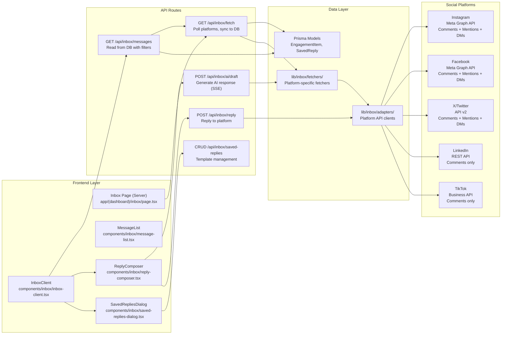

# Unified Inbox Implementation Plan

## Overview

Build a Unified Inbox at `/inbox` that aggregates engagement (comments, mentions, DMs) from Instagram, Facebook, X/Twitter, LinkedIn, and TikTok into a single cross-platform timeline. Includes AI-assisted response drafting using existing brand voice, saved reply templates, and platform-specific filters.

## Architecture



## Platform Coverage Matrix

| Capability | Instagram | Facebook | X/Twitter | LinkedIn | TikTok | Pinterest |
|---|---|---|---|---|---|---|
| Comments | Yes | Yes | Yes | Yes | Yes | No |
| Mentions | Yes | Yes | Yes | No (webhook only) | Partial | No |
| DMs | Yes (24h window) | Yes | Yes | No (partner-only) | No | No |

Pinterest excluded entirely (no engagement API). LinkedIn DMs excluded (partner-only). TikTok mentions excluded (partial support).

## Prisma Schema Changes

Add two new models to `prisma/schema.prisma`:

```prisma
model EngagementItem {
  id            String    @id
  workspaceId   String
  platform      String      // "instagram", "facebook", "x", "linkedin", "tiktok"
  type          EngagementType  // COMMENT, MENTION, DM
  platformItemId String   // External ID from platform (comment ID, tweet ID, etc.)
  platformUrl   String?   // Direct link to the content on the platform
  authorName    String?   // Who wrote the comment/DM
  authorAvatar  String?   // Avatar URL
  content       String    // The comment/mention/DM text
  parentContent String?   // Context: the post text being commented on
  parentId      String?   // Parent EngagementItem ID (for nested replies)
  inReplyToId   String?   // If this is a reply, what EngagementItem it replies to
  status        EngagementStatus @default(UNREAD)
  sentiment     String?   // AI-analyzed: "positive", "neutral", "negative"
  aiDraft       String?   // AI-generated draft response (cached)
  createdAt     DateTime  @default(now())
  syncedAt      DateTime  @default(now())
  repliedAt     DateTime?
  Workspace     Workspace @relation(fields: [workspaceId], references: [id], onDelete: Cascade)

  @@index([workspaceId, status])
  @@index([workspaceId, platform])
  @@index([workspaceId, type])
  @@index([workspaceId, createdAt(sort: Desc)])
  @@index([workspaceId, sentiment])
}

model SavedReply {
  id          String    @id
  workspaceId String
  title       String    // "Thanks for the feedback!"
  content     String    // The reply text
  tags        String[]  // ["faq", "support", "engagement"]
  platform    String?   // null = all platforms, or specific platform
  usageCount  Int       @default(0)
  createdAt   DateTime  @default(now())
  updatedAt   DateTime  @updatedAt
  Workspace   Workspace @relation(fields: [workspaceId], references: [id], onDelete: Cascade)

  @@index([workspaceId])
  @@index([workspaceId, tags])
}

enum EngagementType {
  COMMENT
  MENTION
  DM
}

enum EngagementStatus {
  UNREAD
  READ
  REPLIED
  DISMISSED
}
```

## Implementation Tasks

### Task 1: Database Schema + Migration

**Files**: `prisma/schema.prisma`

1. Add `EngagementItem`, `SavedReply` models and `EngagementType`, `EngagementStatus` enums
2. Run `pnpm dlx prisma db push` and `pnpm dlx prisma generate`
3. Verify Prisma client types compile

### Task 2: Platform Fetcher Infrastructure

**New files**:

- `lib/inbox/types.ts` — Shared types for inbox engagement data
- `lib/inbox/adapters/index.ts` — Platform adapter registry (follows `lib/publish/adapters/` pattern)
- `lib/inbox/adapters/instagram.ts` — Meta Graph API: comments, mentions, DMs
- `lib/inbox/adapters/facebook.ts` — Meta Graph API: comments, mentions, conversations
- `lib/inbox/adapters/x.ts` — X API v2: replies, mentions, DM events
- `lib/inbox/adapters/linkedin.ts` — LinkedIn REST API: comments via `socialActions`
- `lib/inbox/adapters/tiktok.ts` — TikTok Business API: comments via `/comment/list/`
- `lib/inbox/fetchers/sync-engagement.ts` — Orchestrates fetching from all connected platforms and persisting to DB

**Key patterns** (based on existing `lib/publish/adapters/`):

Each platform adapter implements:
```typescript
interface EngagementAdapter {
  platform: PlatformName;
  fetchComments(postId: string, since?: Date): Promise<RawComment[]>;
  fetchMentions(since?: Date): Promise<RawMention[]>;
  fetchDMs(since?: Date): Promise<RawDM[]>;
  replyToComment(commentId: string, text: string): Promise<{ success: boolean; error?: string }>;
  replyToDM(conversationId: string, text: string): Promise<{ success: boolean; error?: string }>;
}
```

**Rate limit handling**:
- Instagram: 200 calls/hour per account — cache results, use `since` cursor
- Facebook: 4800x users/24h — generous, standard polling
- X/Twitter: DMs 15/15min — aggressive caching, batch fetch
- LinkedIn: Undisclosed — conservative polling
- TikTok: 5000/day (research) — safe for MVP scale

**Sync logic** (`sync-engagement.ts`):
- Called on page load and via `POST /api/inbox/fetch`
- For each connected account: fetch new items since last `syncedAt`
- Deduplicate by `platformItemId` (upsert)
- Return new items count for toast notification

### Task 3: API Routes

**New files**:

- `app/api/inbox/messages/route.ts` — `GET`: Read paginated engagement items with filters (platform, type, status, search)
- `app/api/inbox/fetch/route.ts` — `POST`: Trigger platform sync, returns new items count
- `app/api/inbox/reply/route.ts` — `POST`: Reply to an engagement item (sends to platform + updates status)
- `app/api/inbox/status/route.ts` — `POST`: Mark as read/dismissed
- `app/api/inbox/ai/draft/route.ts` — `POST`: Generate AI response draft using existing `ChatOpenAI` + `loadBrandContextForAI` + `buildComposePrompts` (SSE streaming like `/api/compose/suggest`)
- `app/api/inbox/saved-replies/route.ts` — `GET`/`POST`: List and create saved replies
- `app/api/inbox/saved-replies/[id]/route.ts` — `GET`/`PATCH`/`DELETE`: CRUD per saved reply

**Route patterns** (follow existing pattern from `app/api/dashboard/insights/route.ts` and `app/api/compose/suggest/route.ts`):

```typescript
// Standard auth + workspace check
const session = await auth();
if (!session?.user) return NextResponse.json({ error: "Unauthorized" }, { status: 401 });
const user = session.user as { id?: string; workspaceId?: string };
const workspaceId = user.workspaceId;
if (!workspaceId) return NextResponse.json({ error: "No workspace" }, { status: 400 });

// Zod validation for POST bodies
// logger.child({ requestId }) for correlation
// Structured error responses
```

**AI draft route** (follows `app/api/compose/suggest/route.ts` SSE streaming):
- Input: `engagementItemId`, optional `tone` modifier
- Loads brand context for workspace
- Builds prompt: "Reply to this {comment/mention/DM} in brand voice"
- Streams response via SSE with `content_chunk` events
- Caches result in `EngagementItem.aiDraft`

### Task 4: Inbox Page (Server Component)

**New file**: `app/(dashboard)/inbox/page.tsx`

**Pattern** (follows `app/(dashboard)/calendar/page.tsx`):

```typescript
export default async function InboxPage() {
  // Auth check + redirect (same pattern as calendar/analytics)
  // Fetch initial engagement items from DB
  // Fetch connected accounts for platform filter
  // Pass data to InboxClient component
}
```

- Server component fetches initial 50 most recent items
- Passes `initialItems`, `connectedPlatforms`, `totalCount` to client
- Header: "Inbox" title + description + platform filter chips + status tabs (All/Unread/Replied)
- Layout: Two-panel — message list (left, 40%) + detail/reply panel (right, 60%)

### Task 5: Inbox Client Components

**New files**:

- `components/inbox/inbox-client.tsx` — Main client wrapper with state management, polling trigger
- `components/inbox/message-list.tsx` — Scrollable list of `EngagementItemCard`s, virtualized for performance
- `components/inbox/engagement-item-card.tsx` — Single engagement preview (author avatar, platform icon, content snippet, timestamp, status badge)
- `components/inbox/reply-panel.tsx` — Detail view + reply composer
- `components/inbox/reply-composer.tsx` — Text area with AI draft button, saved replies insert, character counter, platform-specific limits
- `components/inbox/saved-replies-dialog.tsx` — CRUD for saved reply templates
- `components/inbox/platform-filter.tsx` — Platform filter chips (Instagram, Facebook, X, LinkedIn, TikTok)
- `components/inbox/status-tabs.tsx` — All / Unread / Replied / Dismissed tabs
- `components/inbox/empty-inbox-state.tsx` — Four-property empty state (worked example, starting verb, exposed limits)

**Component patterns** (follows `components/analytics/` and `components/compose/`):
- All use shadcn/ui primitives (Card, Button, Badge, Tabs, Input, Textarea, Dialog)
- Phosphor Icons from `/ssr` for server, main for client
- CSS variable tokens from `app/globals.css`
- `cn()` utility for conditional classes

### Task 6: Sidebar Nav Integration

**File**: `app/(dashboard)/layout.tsx`

Add Inbox to `navItems` array:
```typescript
{ label: "Inbox", href: "/inbox", icon: "chat-circle" as const },
```
Place between Analytics and Research.

Verify `chat-circle` icon exists in `@phosphor-icons/react` (grep node_modules).

### Task 7: AI Integration

**Files**: Reuse existing infrastructure

- `lib/ai/brand-context-loader.ts` — Already exists, loads brand context
- `lib/ai/compose-prompt-builder.ts` — Already exists, adapt for reply prompts
- `app/api/inbox/ai/draft/route.ts` — New SSE streaming route

**AI prompt structure**:
```
System: You are replying to a social media engagement on {platform}.
Use this brand voice: {tone, description, examples}.
Be concise, authentic, and match the platform's conventions.

Context: {parentContent}
User says: {content}

Generate a reply that:
- Addresses their point directly
- Matches brand voice
- Fits {platform} character conventions
```

## Verification Steps

- [ ] `pnpm dlx prisma db push` succeeds
- [ ] `pnpm run typecheck` (0 errors)
- [ ] `pnpm run lint` (0 warnings)
- [ ] `pnpm run build` (success)
- [ ] Inbox page loads with connected accounts showing engagement items
- [ ] Platform filter works (only shows items for selected platform)
- [ ] Status tabs work (All/Unread/Replied/Dismissed)
- [ ] Mark as read updates status and UI
- [ ] Reply sends to platform and updates status to REPLIED
- [ ] AI draft generates with brand voice and streams via SSE
- [ ] Saved replies CRUD works
- [ ] Empty state shows with worked example when no engagement items
- [ ] Rate limits respected (no platform API errors from over-fetching)
- [ ] Mobile responsive layout (single-column on mobile, two-panel on desktop)

## Dependencies & Risks

### Dependencies
- **Internal**: Existing OAuth infrastructure (`lib/oauth/`), Prisma schema, auth pattern, logger, brand context loader, AI model config
- **External**: Meta Graph API (Instagram/Facebook), X API v2, LinkedIn REST API, TikTok Business API — all require valid OAuth tokens and correct permissions
- **Database**: New Prisma models require `db push` migration

### Risks

- **X/Twitter DM rate limits (15/15min)**: Very restrictive. Mitigation: Cache aggressively, only fetch DMs on explicit user action, not on page load. Use `since_id` pagination.
- **LinkedIn no DM API**: Cannot include LinkedIn DMs. Mitigation: Show a placeholder card explaining limitation, focus on comments.
- **TikTok Research API approval**: May require separate app approval. Mitigation: Comments via Content Posting API work without Research API for Business accounts.
- **Instagram 24h DM window**: Can only reply to DMs within 24h of user message. Mitigation: Show expiry indicator on DM items, disable reply button for expired items.
- **Platform API changes**: Meta/LinkedIn/TikTok APIs change frequently. Mitigation: Abstract adapter interface, log all API responses for debugging.

### Rollback Plan
- If API integration causes issues: disable specific platform adapters in `lib/inbox/adapters/index.ts` by returning empty arrays
- If AI route causes errors: fall back to no-AI mode (reply composer still works manually)
- If DB migration causes issues: `pnpm dlx prisma db push --force-reset` (will lose synced engagement items, safe to re-fetch)

## Edge Cases

| Scenario | Handling |
|---|---|
| **No connected accounts** | Empty state: "Connect a social account to start receiving engagement" with CTA to Settings |
| **Platform API error** | Per-platform error toast, continue loading from other platforms, show partial data |
| **Rate limit hit** | Show "Rate limited — retrying in X minutes" badge, queue sync for later |
| **Token expired** | "Reconnect {platform}" link redirects to Settings > Connected Accounts |
| **DM expired (24h window)** | Show "Reply window expired" indicator, disable reply button |
| **AI service unavailable** | Fallback to manual compose, banner: "AI temporarily unavailable — compose manually" |
| **Large volume of unread items** | Pagination with "Load more" button, batch "Mark all as read" action |
| **Nested comment threads** | Flatten to 2 levels max (comment + replies), "View on platform" link for deeper threads |

## Execution Order

1. **Database** — Schema changes, migration, Prisma generate (1 file change)
2. **Platform adapters** — Build fetcher infrastructure for all 5 platforms (7 new files, parallelizable per platform)
3. **API routes** — Build 7 API routes (parallelizable — messages, reply, AI draft, saved-replies are independent)
4. **Inbox page + components** — Build server page and 8 client components (sequential — page depends on components existing)
5. **Sidebar integration** — Add nav item (1 line change)
6. **Verification** — Typecheck, lint, build, manual testing

Tasks 2 and 3 can be partially parallelized: Instagram/Facebook adapters (both Meta) can be built together; X/Twitter adapter independently; LinkedIn/TikTok adapters independently.